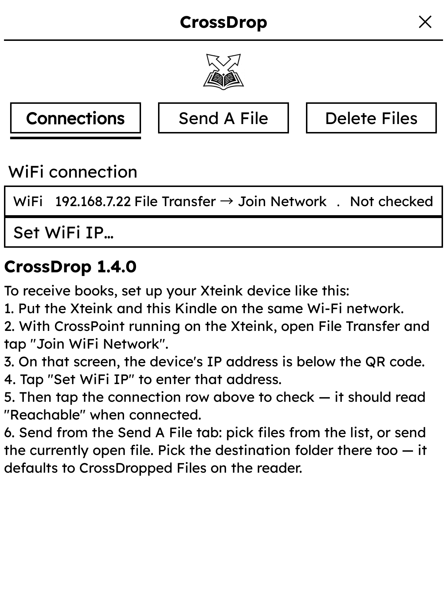
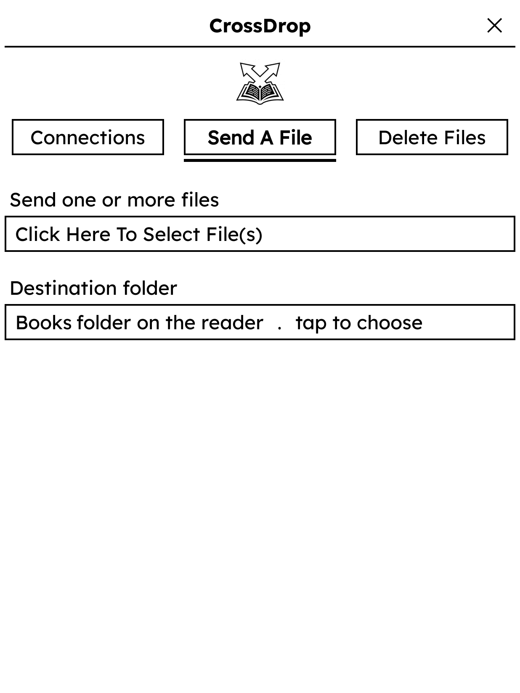
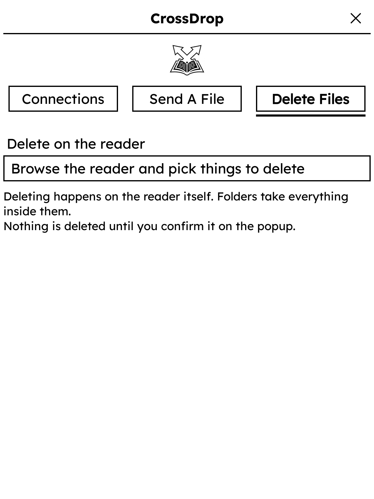
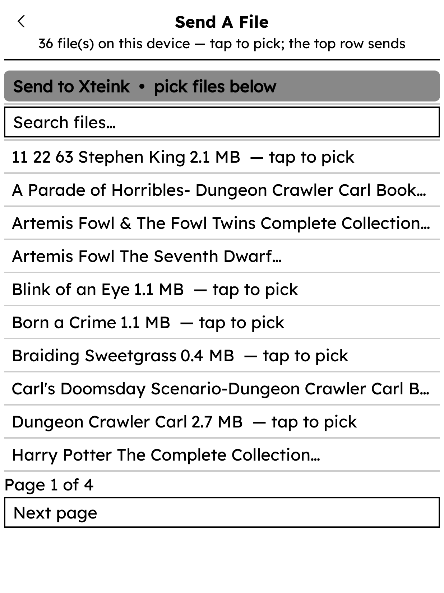
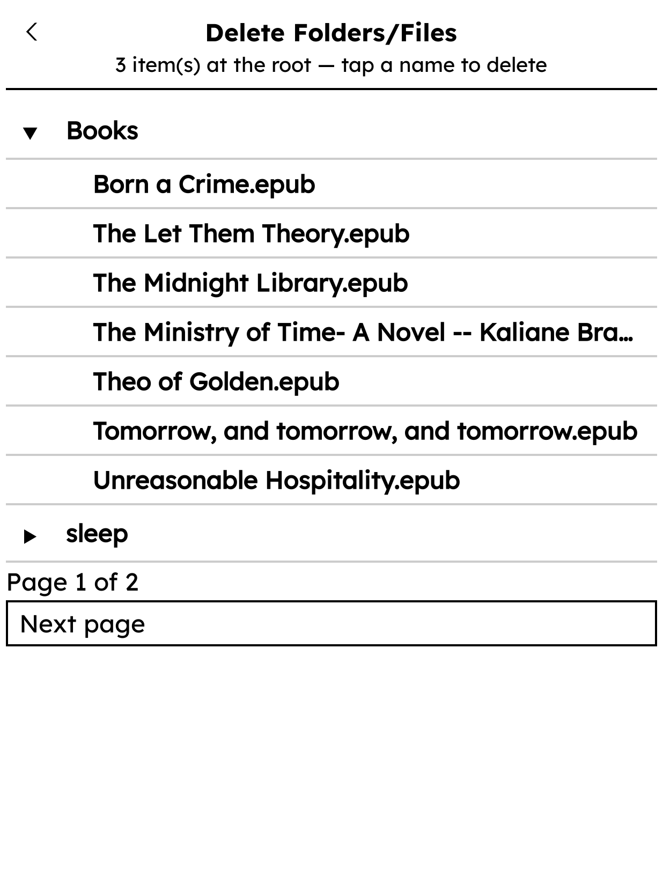

<p align="center">
  
</p>

# CrossDrop

Send books from **KOReader** to your **Xteink (CrossPoint)** e-ink reader over
Wi-Fi — no cable, no cloud.

## What it does

- A full-screen CrossDrop dashboard (**Connections** / **Send A File** /
  **Delete Files**) inside KOReader's Tools menu.
- **Send A File** scans your device and lists only what the reader can
  actually open — **EPUB, XTC/XTCH, TXT, and BMP** (case-insensitive): search
  and multi-pick from the list, or send the file you're currently reading.
- **Delete Files** is its own tab on purpose: deleting never lives among the
  send controls. It browses the reader as the same folder tree (files and
  folders), asks **"Delete file?"** / **"Delete folder and its contents?"**
  first, then removes it — a folder that still holds anything is purged
  depth-first first (the reader's WebDAV DELETE does not recurse), and the
  tree refreshes in place.
- Books land in a **destination folder** on the reader. The destination picker
  is a folder **tree**: tap a folder's ▸/▾ to scan its subfolders — they appear
  indented right below it, and every other folder stays visible; tap a folder's
  name for **Select / Create Subfolder / Cancel**. A new subfolder is picked
  right away and is created on the reader when the books are sent (WebDAV
  MKCOL, at any nesting depth). Nothing chosen = the **CrossDropped Files**
  default, created automatically on the first send.
- A "… please wait" screen while a file streams, and a toast when it lands.
  There's deliberately no progress bar: the transfer drains faster than
  e-ink can repaint.

## Screenshots

The three tabs of the dashboard:

| **Connections** — set the reader's IP, check it reads Reachable | **Send A File** — pick files and the destination folder | **Delete Files** — its own screen, away from the send controls |
|:---:|:---:|:---:|
|  |  |  |

The two browsers, one visual language:

| **Send A File** — only files the reader can open, searchable and paged | **Delete Folders/Files** — the same folder tree, with a confirmation before anything dies |
|:---:|:---:|
|  |  |

## Setup

1. On the reader: open **File Transfer → Join Network** — it shows its IP
   address.
2. On your device, copy `crossdrop.koplugin/` into KOReader's `plugins/`
   folder and restart KOReader — or install straight from **Storefront**
   (search "CrossDrop").
3. Open **Tools → CrossDrop → Connections → Set WiFi IP…** and enter the
   reader's IP. Tap the **WiFi** row to check it reads **Reachable**.
4. Use the **Send A File** tab to pick files and choose a destination folder.

## Build & test

```sh
./scripts/build-zips.sh            # → releases/CrossDrop-Plugin.zip
luajit koreader-plugin/test/harness_crossdrop.lua
```

See `AGENTS.md` for repo conventions. GitHub Actions checks the Lua, runs the
harness, and builds the zip on each push/PR.